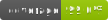

# nwdocstringchecking

Contact: numbworks@gmail.com

## Introduction

From the documentation:

> `nwdocstringchecking` is a CLI application designed to check which methods in a Python file lack docstrings.

## Getting started

- [Documentation](docs/docs-nwdocstringchecking.md)

## Other links

- [LICENSE](LICENSE)